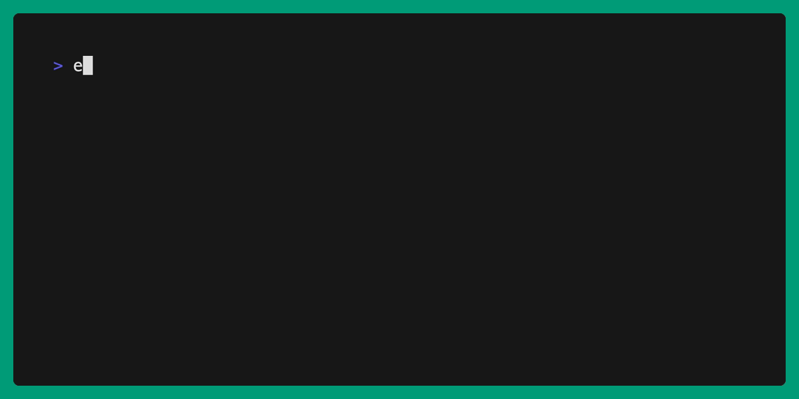

# Replicate CLI



## Install

If you're using macOS, you can install the Replicate CLI using Homebrew:

```console
brew tap replicate/tap
brew install replicate
```

Or you can build from source and install it with these commands
(requires Go 1.20 or later):

```console
make
sudo make install
```

## Usage

Grab your API token from [replicate.com/account](https://replicate.com/account)
and set the `REPLICATE_API_TOKEN` environment variable.

```console
$ export REPLICATE_API_TOKEN=<your token here>
```

---

```console
Usage:
  replicate [command]

Core commands:
  hardware    Interact with hardware
  model       Interact with models
  prediction  Interact with predictions
  scaffold    Create a new local development environment from a prediction
  training    Interact with trainings

Alias commands:
  run         Alias for "prediction create"
  train       Alias for "training create"

Additional Commands:
  completion  Generate the autocompletion script for the specified shell
  help        Help about any command

Flags:
  -h, --help      help for replicate
  -v, --version   version for replicate

Use "replicate [command] --help" for more information about a command.```

---

### Create a prediction

Generate an image with [SDXL].

```console
$ replicate run stability-ai/sdxl \
      prompt="a studio photo of a rainbow colored corgi"
Prediction created: https://replicate.com/p/jpgp263bdekvxileu2ppsy46v4
```

### Create a local development environment from a prediction

Create a Node.js or Python project from a prediction.

```console
$ replicate scaffold https://replicate.com/p/jpgp263bdekvxileu2ppsy46v4 --template=node
Cloning starter repo and installing dependencies...
Cloning into 'jpgp263bdekvxileu2ppsy46v4'...
Writing new index.js...
Running example prediction...
[
  'https://replicate.delivery/pbxt/P79eJmjeJsql40QpRbWVDtGJSoTtLTdJ494kpQexSDhYGy0jA/out-0.png'
]
Done!
```

### Chain multiple predictions

Generate an image with [SDXL] and upscale that image with [ESRGAN].

```console
$ replicate run stability-ai/sdxl \
      prompt="a studio photo of a rainbow colored corgi" | \
  replicate run nightmareai/real-esrgan --web \
      image={{.output[0]}}
# opens prediction in browser (https://replicate.com/p/jpgp263bdekvxileu2ppsy46v4)
```

### Create a model

Create a new model on Replicate.

```console
$ replicate model create yourname/model --private --hardware gpu-a40-small
```

To list available hardware types:

```console
$ replicate hardware list
```

After creating your model, you can [fine-tune an existing model](https://replicate.com/docs/fine-tuning) or [build and push a custom model using Cog](https://replicate.com/docs/guides/push-a-model).

### Fine-tune a model

Fine-tune [SDXL] with your own images:

```console
$ replicate train --destination mattt/sdxl-dreambooth --web \
      stability-ai/sdxl \
      input_images=@path/to/pictures.zip \
      use_face_detection_instead=true
# opens the training in browser
```

> [!NOTE]
> Use the `@` prefix to upload a file from your local filesystem.
> It works like curl's `--data-binary` option.

For more information,
see [our blog post about fine-tuning with SDXL](https://replicate.com/blog/fine-tune-sdxl).

### View a model's inputs and outputs

Get the schema for [SunoAI Bark]

```console
$ replicate model schema suno-ai/bark
Inputs:
- prompt: Input prompt (type: string)
- history_prompt: history choice for audio cloning, choose from the list (type: )
- custom_history_prompt: Provide your own .npz file with history choice for audio cloning, this will override the previous history_prompt setting (type: string)
- text_temp: generation temperature (1.0 more diverse, 0.0 more conservative) (type: number)
- waveform_temp: generation temperature (1.0 more diverse, 0.0 more conservative) (type: number)
- output_full: return full generation as a .npz file to be used as a history prompt (type: boolean)

Output:
- type: object
```

[api]: https://replicate.com/docs/reference/http
[LLaMA 2]: https://replicate.com/replicate/llama-2-70b-chat
[SDXL]: https://replicate.com/stability-ai/sdxl
[ESRGAN]: https://replicate.com/nightmareai/real-esrgan
[SunoAI Bark]: https://replicate.com/suno-ai/bark
